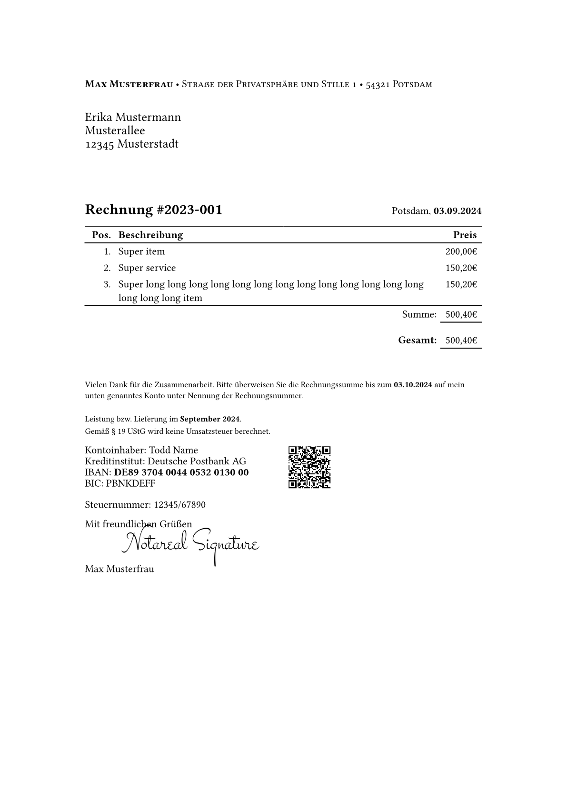

# Facture Template

This template was forked from [typst-invoice](https://github.com/erictapen/typst-invoice)
and acts mainly as template for [facture](https://github.com/giomf/facture) but can also be used stand alone.

>[!WARNING]
> The API is not stable yet!

## Getting started
See the [exmaple](examples/main.typ)  

## Scope

This template should work well for freelancers and small companies in the german market, that don't have an existing system in place for order tracking.
Or to put it the other way round;
This template is for people that mostly have to fulfill outside requirements with their invoices and don't so much benefit from extensive tracking themselfes.

## Features

- [X] multiple invoice items
- [X] configurable VAT
- [X] VAT is calculated on top of total
- [X] configurable § 19 UStG (Kleinunternehmerregelung) note
- [X] configurable signature from PNG file
- [X] configurable due date
- [X] configurable text below items with variable support
- [X] employs both lining and old-style number types, depending on the application
- [X] [EPC QR Code](https://en.wikipedia.org/wiki/EPC_QR_code) for easier banking transactions

## Disclaimer
> [!CAUTION]
> This template doesn't constitute legal advice.
> Please check for yourself wether it fulfills your legal requirements!
